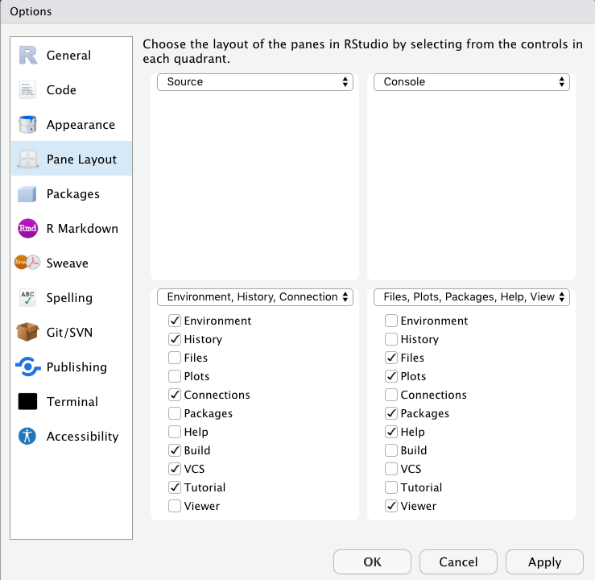

```{r setup, include=FALSE}

library(tidyverse)
library(rvest) 

knitr::opts_chunk$set(echo = TRUE)

latest_version <- 
  read_html("http://cran.rstudio.com/bin/macosx/") %>% 
  html_nodes(xpath = "//td/a") %>% .[1] %>%
  html_attr("href")

```

## Introduction {.tabset}

### Mac

#### Install R 

1. Go to [https://cran.rstudio.com/bin/macosx/](https://cran.rstudio.com/bin/macosx/). 

2. Select the latest available version of R to install. As of `r Sys.Date()` the latest version was `r latest_version`. 

3. Click on the link for the latest version to download the most current version of R. 

4. Complete the installation process as demonstrated in the following video. 

<video width = "100%" controls>
  <source src="install_r_mac_os.mp4" type="video/mp4">
</video>

#### Install RStudio

1. Go to [https://rstudio.com/products/rstudio/download/#download](https://rstudio.com/products/rstudio/download/#download).

2. RStudio will recommend the latest version for your operating system at the top of your web browser with a blue download button. Click this button to download RStudio. 

3. Complete the installation process as demonstrated in the following video. 

<video width = "100%" controls>
  <source src="install_rstudio_mac_os.mp4" type="video/mp4">
</video>

#### Open and Setup RStudio 

1. Go to your applications folder and launch RStudio. RStudio will automatically detect your R installation. 

2. In the top menu bar go to Tools  > Global Options

3. On the Pane Layout tab arrange your windows as shown below



4. On the Appearance tab 
- Select Modern for your RStudio theme
- Select "Cobalt" for your editor theme

<video width = "100%" controls>
  <source src="open_and_setup_rstudio_mac_os.mp4" type="video/mp4">
</video>

### RMarkdown Example

#### Install Packages

Install the `tidyverse` and `knitr` packages by running the following command in the console of RStudio: `install.packages(c("tidyverse", "knitr"))`.  This will print out a number of messages to your console as the packages are installed. 

<video width = "100%" controls>
  <source src="install_packages.mp4" type="video/mp4">
</video>

#### Markdown Example

1. From the File menu select New File > R Markdown. 
2. Title your file Example.
3. Select html for the output format.
4. Click Ok.


<iframe width="1120" height="630" src="https://www.youtube.com/embed/pwBAxhVX_us" frameborder="0" allow="accelerometer; autoplay; encrypted-media; gyroscope; picture-in-picture" allowfullscreen></iframe>
